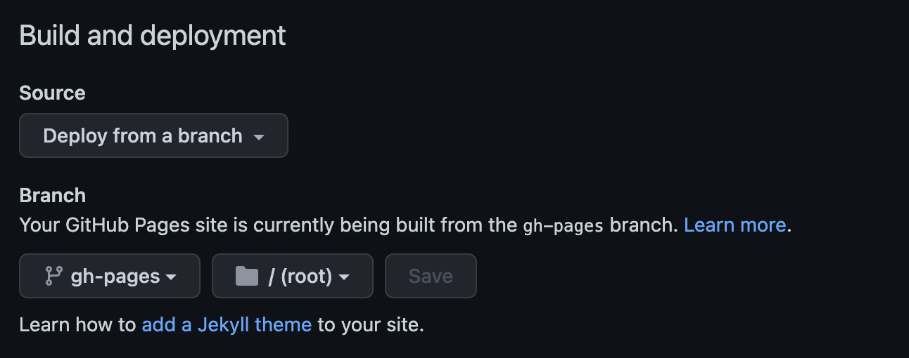

## 1. Github에 저장소 만들기

[Jekyll과 Github Page로 블로그 구축하기](./2022-12-29-jekyll-github-blog.md#_1-github에-저장소-만들기)문서를 참고해서 Github에 저장소를 생성합니다.

## 2. Vuepress 사이트 생성

node와 yarn이 설치되어 있다고 가정합니다.

### vuepress 사이트 생성

yarn을 사용해 다음과 같이 vuepress 사이트를 생성합니다.

```bash
yarn create vuepress-site myblog
```

모두 기본값을 선택하고 완료합니다.

### 모듈 설치

다음과 같이 실행해 노드 모듈을 설치합니다.

```bash
cd docs
yarn install
```

### 로컬PC에서 사이트 구동

다음과 같이 로컬PC에서 사이트를 구동합니다.

```bash
yarn dev
```

브라우저에서 `http://localhost:8080/`주소로 접속해서 사이트를 확인할 수 있습니다.

## 3. Github Page에 변경된 사이트 출판하기

Github Action을 사용하면 사이트가 변경될 경우 github의 main브랜치에 push하는 것만으로 사이트를 출판할 수 있습니다.

`.github/workflows` 디렉토리를 root(docs의 상위)에 생성하고 `vuepress-deploy.yml`파일을 다음과 같이 작성합니다.

```yaml
name: Build and Deploy
on: [push]
jobs:
  build-and-deploy:
    runs-on: ubuntu-latest
    steps:
      - name: Checkout
        uses: actions/checkout@master

      - name: Deploy Build Files
        uses: jenkey2011/vuepress-deploy@master
        env:
          ACCESS_TOKEN: ${{ secrets.ACCESS_TOKEN }}
          BUILD_SCRIPT: yarn && yarn build
          TARGET_BRANCH: gh-pages
          BUILD_DIR: docs/.vuepress/dist
```

주의해서 볼 곳은 다음 두 항목입니다.

- ACCESS_TOKEN: [Github에서 Personal Access Token을 생성](https://docs.github.com/en/authentication/keeping-your-account-and-data-secure/creating-a-personal-access-token)합니다.
- TARGET_BRANCH: gh-pages 브랜치를 미리 생성해 두고, 다음과 같이 Github Repository Pages 설정을 해야 합니다.


